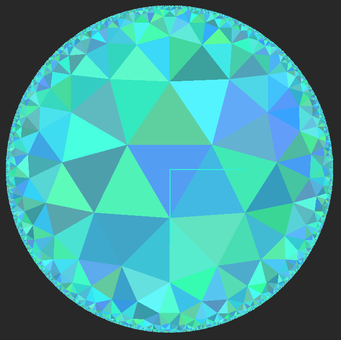
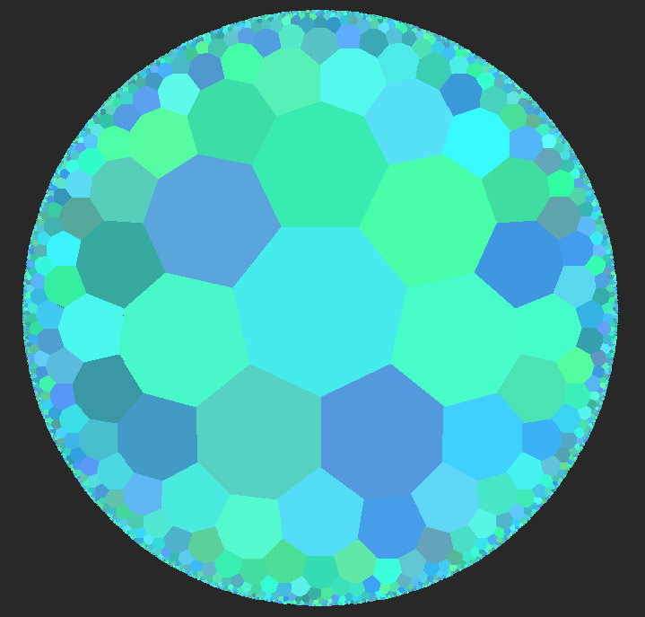
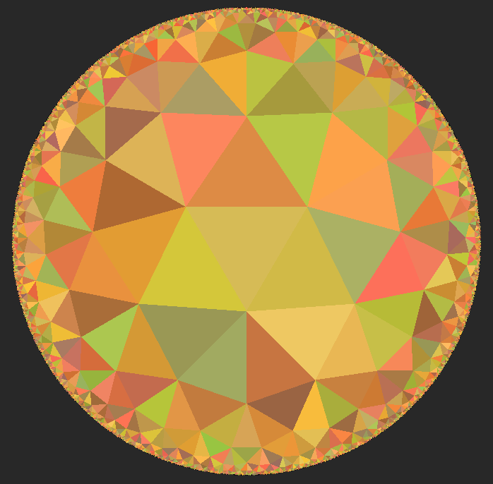
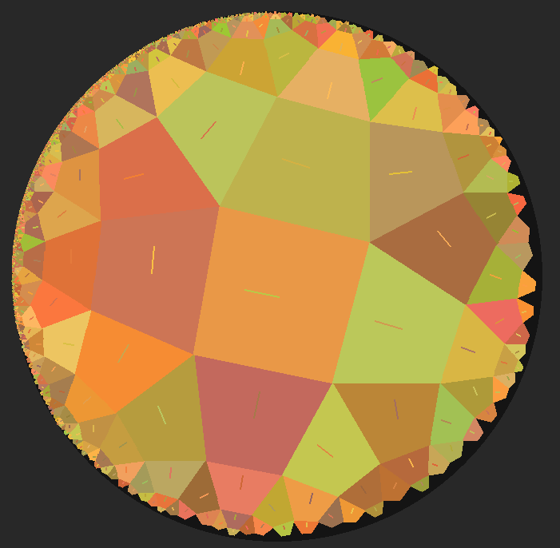
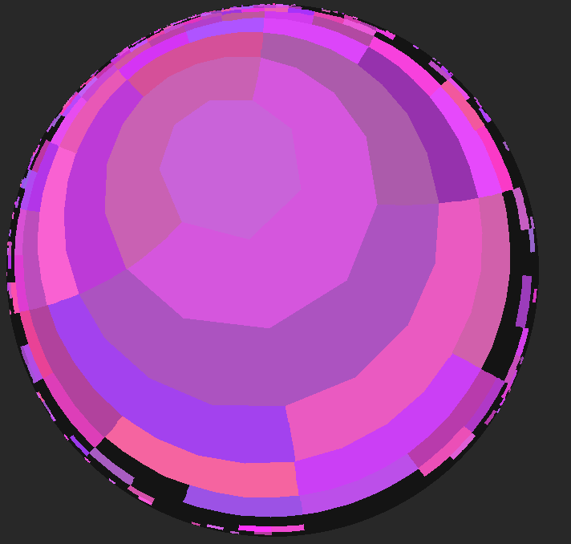
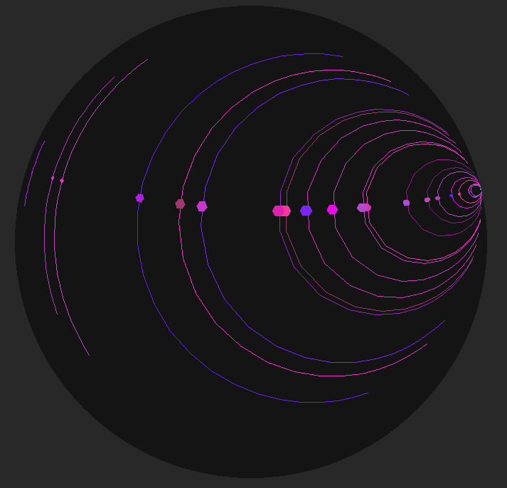
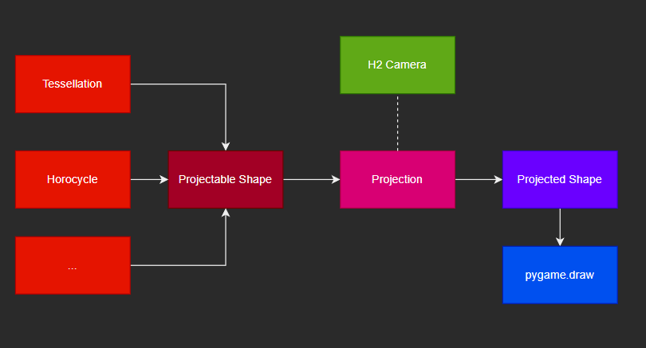

# Hypercrystal

Hyperbolic geometry utilities and visualizations for experiments,
prototyping and research. The library exposes math primitives, projection
models, shapes, and camera abstractions that power the scripts in
[examples](examples).

## Gallery

|  |  |  |
| --- | --- | --- |
|  |  |  |

## Install

```bash
pip install hypercrystal
```

For local development:

```bash
pip install --editable .
```

## Quick Start

```python
from hypercrystal import H2Camera, H2Vector
from hypercrystal.projections import GeneralPerspectiveModel

camera = H2Camera(H2Vector(), H2Vector.FromHyperbolical(0, 0.5), zoom=0.95)
projection = GeneralPerspectiveModel(camera, (900, 700), perspective_distance=3)
```

Explore the runnable examples under [examples/](examples) (e.g.
[`python examples/tessellations.py`](examples/tessellations.py)) to see full scenes with interactivity.

## Pipeline



Scenes start by composing native H² [shapes](src/hypercrystal/shapes) (lines, circles, hypercycles,
polygons, etc.). Before rendering, those shapes are converted into a common
projectable form: polygons, line segments, and—when using [PointcareModel](src/hypercrystal/projections/pointcare.py)—
circles. That normalized set feeds into whichever projection model you choose.
Each [ProjectionModel](src/hypercrystal/projections/h2_projection.py) owns a camera that transforms world-space coordinates
into view space, then emits [ProjectedShape](src/hypercrystal/shapes/projected.py) objects carrying everything needed
for your `pygame.draw*` calls (points, colors, metadata). The result is a clean
flow from abstract hyperbolic geometry to pixels.

Projection models also have `cull_and_project...` functions which take extra `circle_hulls: list[H2Circle]`
argument of same length, and only project the shape if its circle hull is in cull range.
`cull_range` can be set for any projection and shapes have `.circle_hull` property which can
be used to obtain the circle hull of any shape. Look at [culling.py](examples/culling.py) and [tessellations.py](examples/tessellations.py)

## Directory Overview

- [src/hypercrystal/](src/hypercrystal)
  - [h2_math/](src/hypercrystal/h2_math): Hyperbolic vectors, transforms, rays, helper functions.
  - [misc/](src/hypercrystal/misc): Cameras, walkers, lookup utilities used by projections and demos.
  - [projections/](src/hypercrystal/projections): Models that map H² entities into drawable Euclidean scenes.
  - [shapes/](src/hypercrystal/shapes): Core geometry (lines, circles, polygons, horocycles, etc.).
  - [tessellations/](src/hypercrystal/tessellations): Tile generation and traversal helpers.
  - [notation.py](src/hypercrystal/notation.py): Shared constants and naming helpers.
- [examples/](examples): Optional gallery of ready-made scenes (not shipped
  with the PyPI release).

## Contributing

1. Fork and clone the repo.
2. Install dev dependencies (`pip install -e .` plus whatever extras you need).
3. Run or add scripts in `examples/` to exercise new features.
4. Open a pull request with a short description and screenshots if relevant.
