# Hypercrystal

Hyperbolic geometry utilities and visualizations for experiments,
prototyping and research. The library exposes math primitives, projection
models, shapes, and camera abstractions that power the scripts in
[examples](examples).

## Gallery

|  |  |  |
| --- | --- | --- |
|  |  |  |

## Install

```bash
pip install hypercrystal
```

For local development:

```bash
git clone https://github.com/Tucan444/Hypercrystal.git
cd Hypercrystal
pip install -e .
```

## Quick Start

```python
from hypercrystal import H2Camera, H2Vector
from hypercrystal.projections import GeneralPerspectiveModel

camera = H2Camera(H2Vector(), H2Vector.FromHyperbolical(0, 0.5), zoom=0.95)
projection = GeneralPerspectiveModel(camera, (900, 700), perspective_distance=3)
```

Explore the runnable examples under [examples/](examples) (e.g.
[`python examples/tessellations.py`](examples/tessellations.py)) to see full scenes with interactivity.

## Pipeline


Scenes start by composing of native H² [shapes](src/hypercrystal/shapes) (lines, circles, hypercycles,
polygons, etc.). Before rendering, those shapes are converted into a common
projectable form: polygons, line segments, and—when using [PointcareModel](src/hypercrystal/projections/pointcare.py)—
circles. That normalized set feeds into whichever projection model you choose.
Each [ProjectionModel](src/hypercrystal/projections/h2_projection.py) owns a camera that transforms world-space coordinates
into view space, then emits [ProjectedShape](src/hypercrystal/shapes/projected.py) objects carrying everything needed
for your `pygame.draw*` calls (points, colors, metadata). The result is a clean
flow from abstract hyperbolic geometry to pixels.

Projection models also have `cull_and_project...` functions which take extra `circle_hulls: list[H2Circle]`
argument of same length, and only project the shape if its circle hull is in cull range.
`cull_range` can be set for any projection, shapes have `.circle_hull` property which can
be used to obtain the circle hull of any shape. Look at [culling.py](examples/culling.py) and [tessellations.py](examples/tessellations.py)

## Shapes

| Circles | Lines | Polygons |
| --- | --- | --- |
| 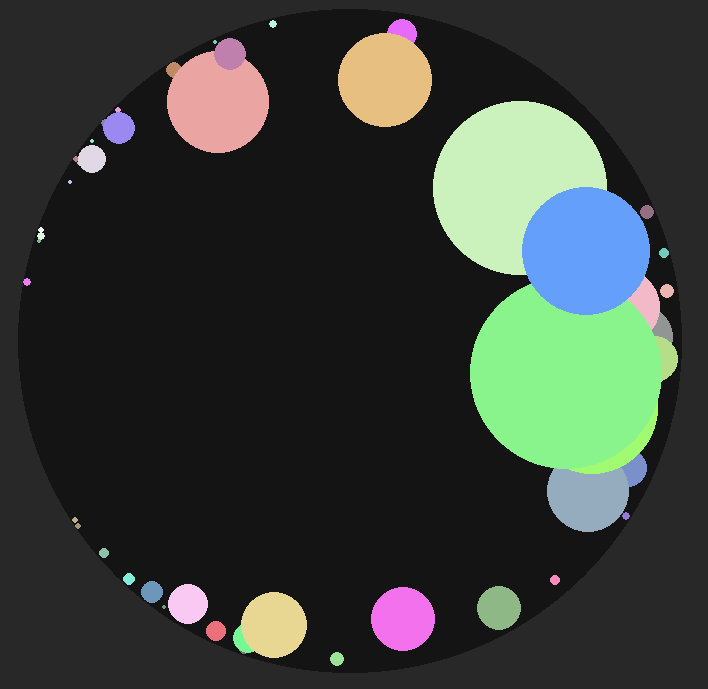 | 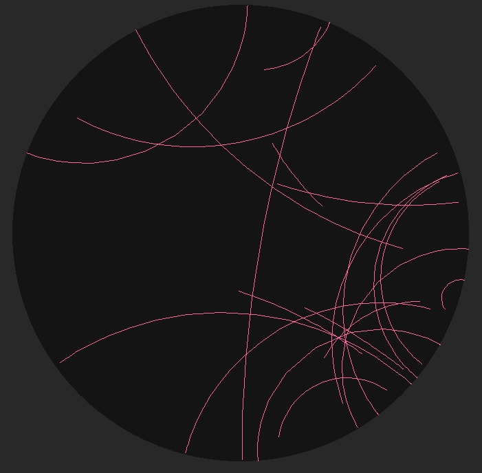 | 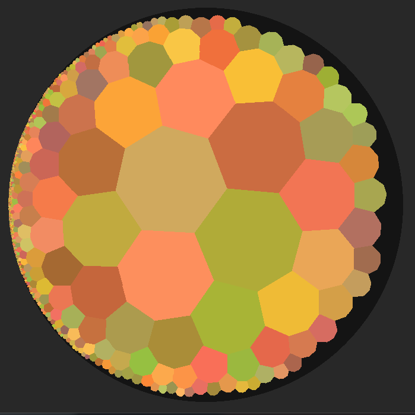 |

| Circle arcs (+extra polygon)                 | Hypercycles (yellow line shows the source geodesic) | Horocycles |
|----------------------------------------------| --- | --- |
| 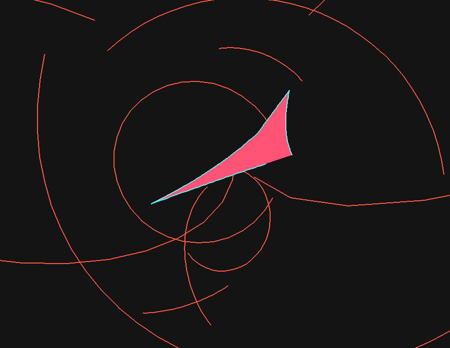 | 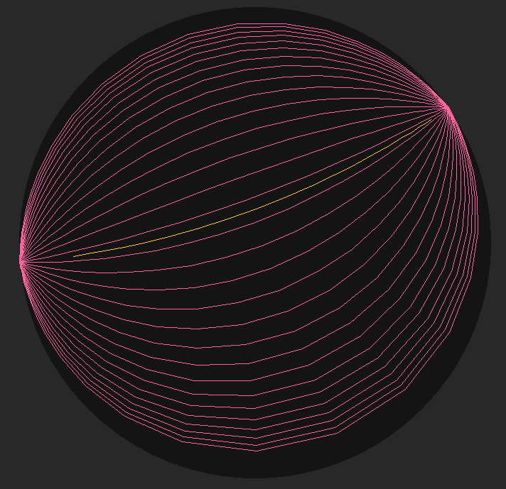 | 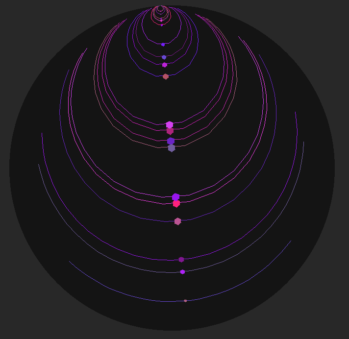 |


- ### Shape descriptions

- [`H2Circle(center: H2Vector, radius: float, key=None)`](src/hypercrystal/shapes/circle.py) — the simplest native H² primitive.
The optional `key` travels through projection and internal methods so you can identify the original source shape after it has been converted into polygons or projected geometry.

- [`H2Line(a: H2Vector, b: H2Vector, key=None)`](src/hypercrystal/shapes/line.py) — straight geodesics, they stay straight under the Klein model, so lines never need to be approximated there.

- [`H2Polygon(points: list[H2Vector], key=None, is_line: bool=False)`](src/hypercrystal/shapes/polygon.py) — a flexible wrapper used for both closed loops and open segments. When `is_line=True`, downstream consumers (like [`H2Ray`](src/hypercrystal/h2_math/h2_ray.py) or [`H2Polygon.subdivide`](src/hypercrystal/shapes/polygon.py)) treat it as a non-looping linear curve.

- [`H2Arc(center: H2Vector, anchor: H2Vector, length: float, key=None)`](src/hypercrystal/shapes/arc.py) — circle arcs measured by angle `length`. Positive `length` advances in the clockwise direction defined by the internal [`is_clockwise(...)`](src/hypercrystal/h2_math/high_functions.py) helper, which orients Y/Z consistently. The [`ThreePoint`](src/hypercrystal/shapes/arc.py) constructor infers direction from three sampled points.

- [`Hypercycle(line: H2Line, distance: float, bounds: tuple[float, float], key=None)`](src/hypercrystal/shapes/hypercycle.py) — equidistant curve relative to a line. In hyperbolic space these are not lines (unlike Euclidean intuition), so the constructor stores a source line, perpendicular distance, and parametric bounds for sampling.

- [`Horocycle(angle_to_horizon: float, anchor: H2Vector, bounds: tuple[float, float]=None, key=None)`](src/hypercrystal/shapes/horocycle.py) — circles touching infinity. Each horocycle can extend indefinitely and encloses infinite area; `.bounds` merely clamps what you draw. Curvature matches the negation of the ambient Gaussian curvature, so these feel “flat” locally while still bending in models like Poincaré.

[Projected counterparts](src/hypercrystal/shapes/projected.py) (`ProjectedCircle`, `ProjectedLine`, `ProjectedPolygon`) hold the Euclidean screen space data emitted by projection models. They carry the original `key`, and are intentionally lightweight so they can feed straight into `pygame.draw*` helpers without additional translation. 
`ProjectedCircle` is currently only used in [PointcareModel](src/hypercrystal/projections/pointcare.py) as the projection keeps circles circles.
Projecting lines and polygons is defined for all projections even if lines cant be projected faithfully.

## Projections

| GansModel | KleinModel | PointcareModel |
| --- | --- | --- |
| 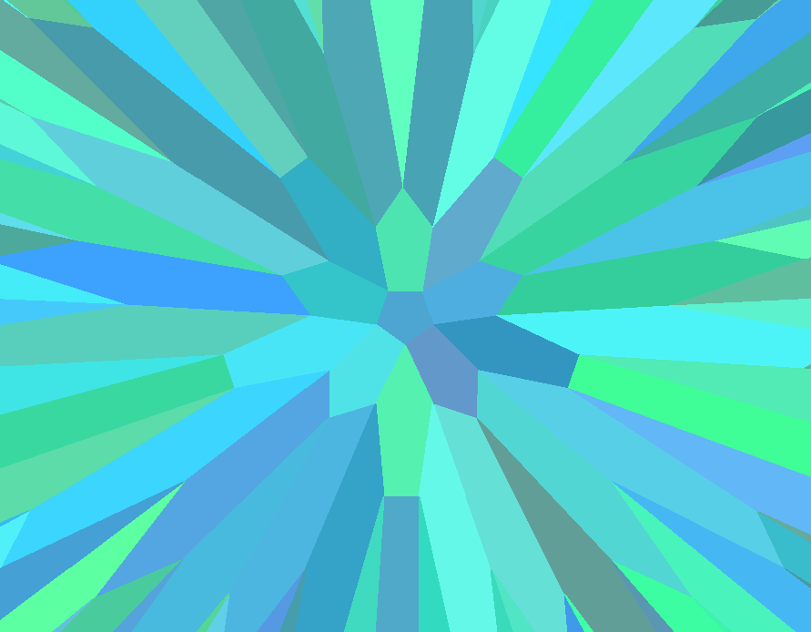 | 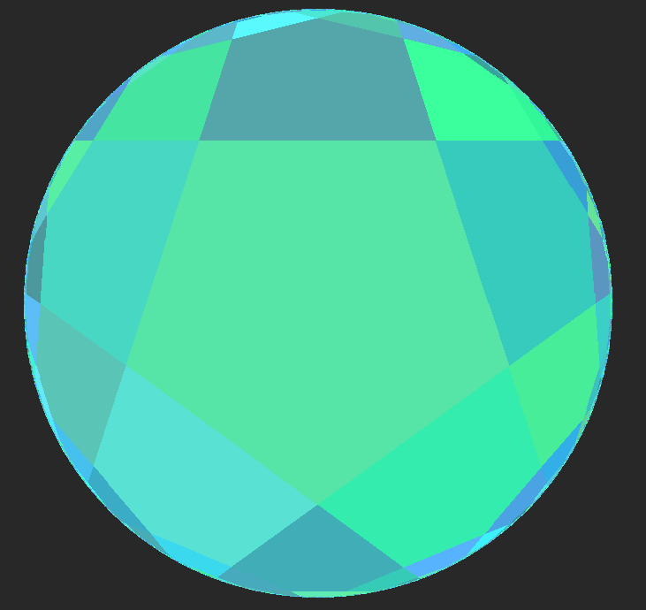 | 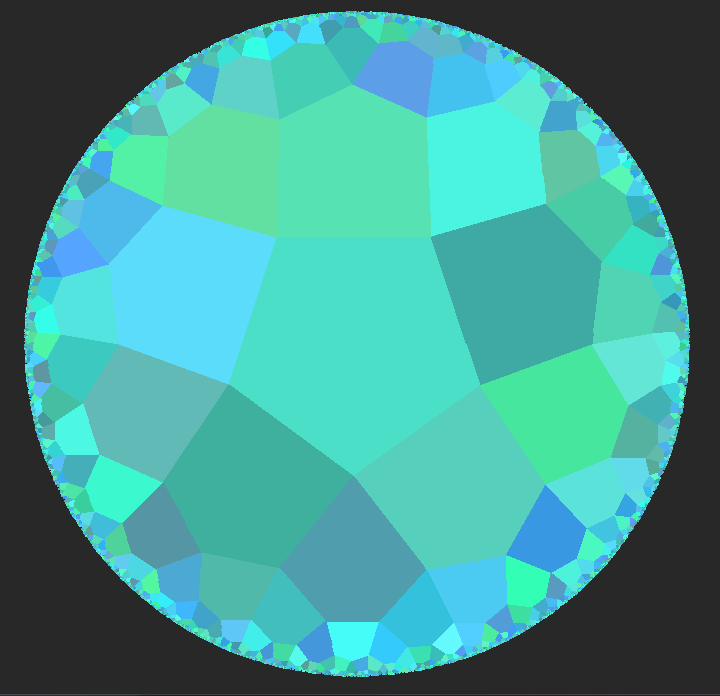 |

| HyperpolarModel | HyperbolicalModel | GeneralPerspectiveModel (P = 2.0) |
| --- | --- | --- |
|  | 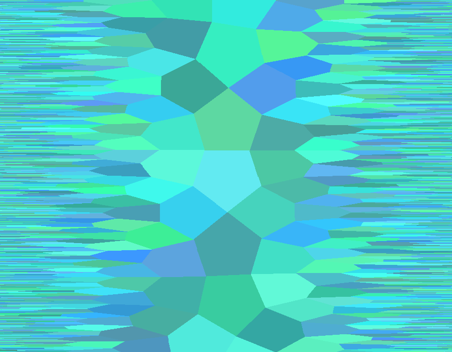 | 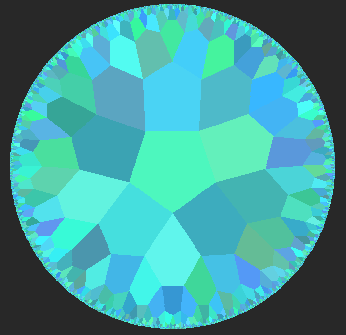 |

<p align="center">
  <strong>GeneralPerspectiveModel (P = -0.8)</strong><br/>
  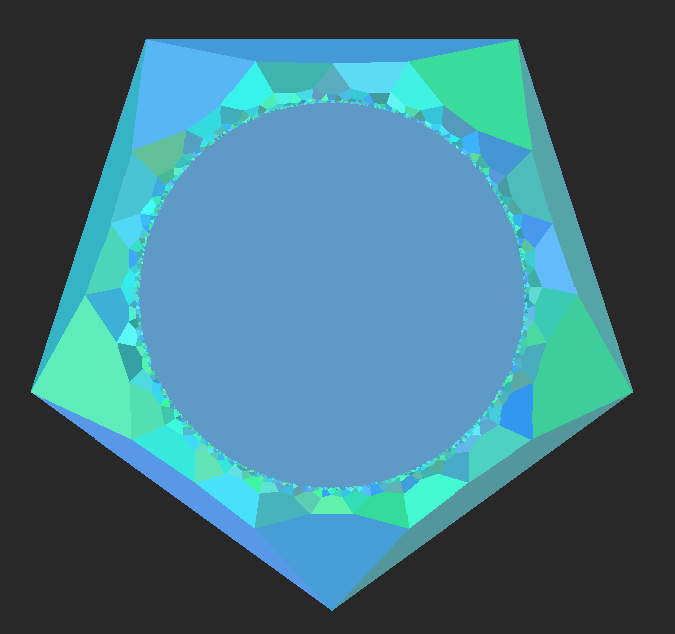
</p>

### Projection descriptions

- [`GansModel`](src/hypercrystal/projections/gans.py) — orthographic projection that simply drops the X coordinate, ideal for quick views that ignore parallax.
- [`KleinModel`](src/hypercrystal/projections/klein.py) — projects from `[0, 0, 0]`, preserving straight lines as straight segments, which makes it handy for reasoning about geodesics.
- [`PointcareModel`](src/hypercrystal/projections/pointcare.py) — projects from `[-1, 0, 0]`, keeping circles as circles. Horocycles remain circles while lines and hypercycles become arcs.
- [`GeneralPerspectiveModel`](src/hypercrystal/projections/general_perspective.py) — projects from `[-P, 0, 0]`, where `P` is the `perspective_distance` argument (changeable after construction) to dial in perspective strength.
- [`HyperpolarModel`](src/hypercrystal/projections/hyperpolar.py) — interprets hyperpolar coordinates directly as Euclidean polar coordinates for rendering.
- [`HyperbolicalModel`](src/hypercrystal/projections/hyperbolical.py) — treats hyperbolical coordinates as Euclidean `(x, y)` pairs, offering a literal view of the native parameter space.

## Tessellations

| `{3, 7}` | `{4, 5}` | `{7, 3}` (with forward lines) |
| --- | --- | --- |
| 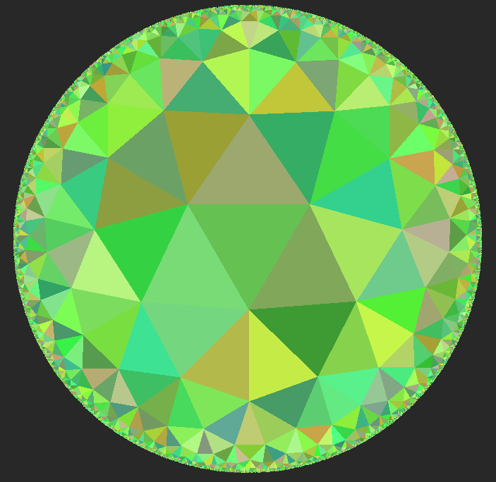 | 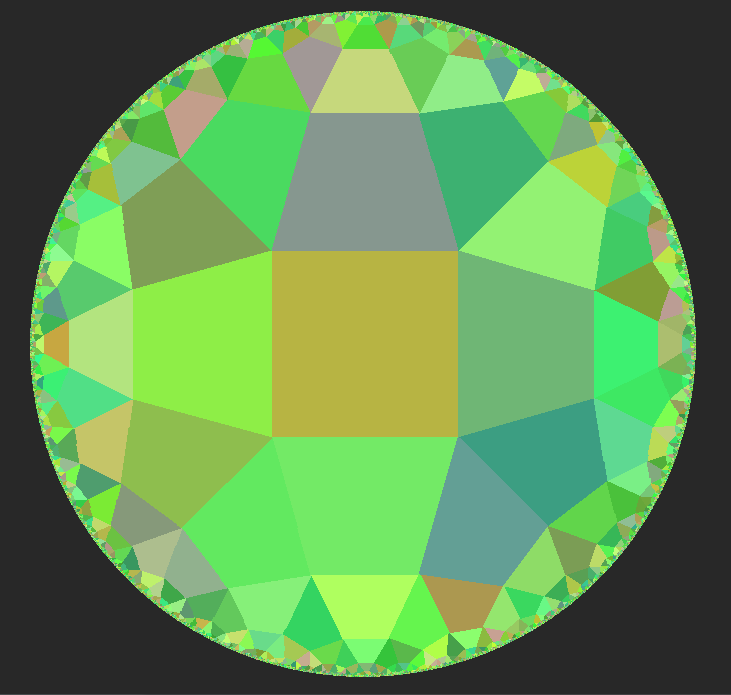 | 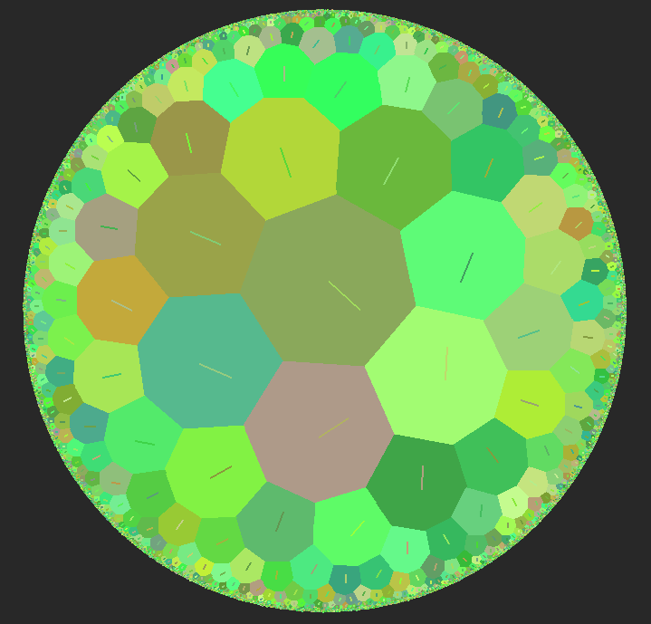 |

Regular hyperbolic tessellations are indexed by their Schläfli symbol `{p, q}`—`p` stands for the number of sides per tile, and `q` states how many of those `p`-gons touch at every vertex. Only configurations with `(p-2)(q-2) > 4` live in H², which is where Hypercrystal operates.
- `{3, 7}` = seven triangles at each vertex
- `{4, 5}` = five squares at each vertex
- `{7, 3}` = three heptagons at each vertex

### Flood tessellation

[`FloodTessellation`](src/hypercrystal/tessellations/flood_tessellation.py) incrementally grows a `{p, q}` tiling. It starts from a root tile and repeatedly adds a new tile to every exposed edge, effectively “flooding” outward layer by layer. Internally it exposes:

- `.root_tile: FloodTile` — the seed tile placed at the tessellation origin.
- `.tiles: list[FloodTile]` — every tile currently generated, in creation order.
- `.tile_layers: dict[int, list[FloodTile]]` — tiles bucketed by growth layer so you can stop at a given radius or animate layer progression.
- `.tile_lookup: H2Lookup[list[FloodTile]]` — a spatial hash used to avoid collisions; lookups are described in the next section.

Tile geometry is returned via `.tile_polygons` (world-space `H2Polygon` list). Additional helpers provide `.tile_circles`, `.tile_inscribed_circles`, and, most importantly, `.tile_forward_lines`. Each `forward_line` shows which direction a tile was spawned from—the parent tile is stored as `tile.tiles[0]`, while the remaining entries enumerate adjacent tiles in clockwise order.

## Spatial Lookups

| Tessellation lookup bins | Randomly populated bins | Dense lookup |
| --- | --- | --- |
| 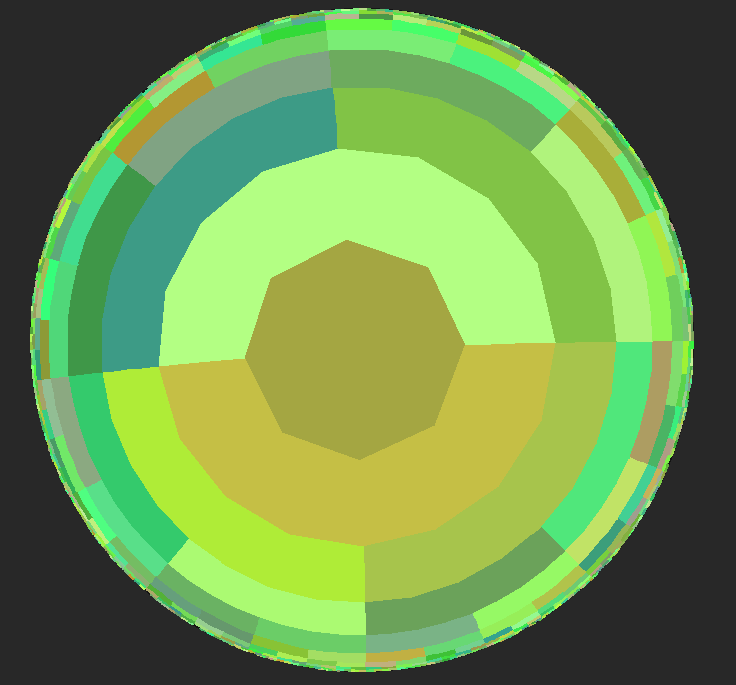 | 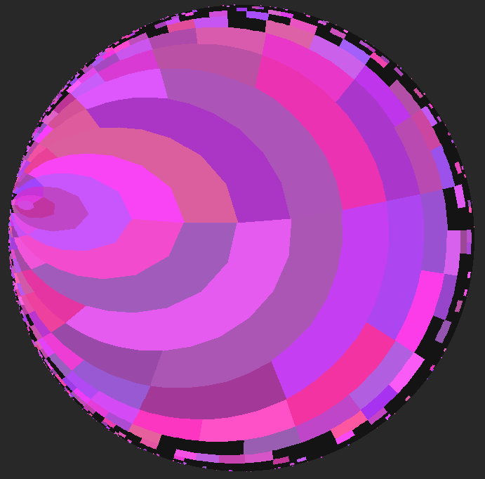 | 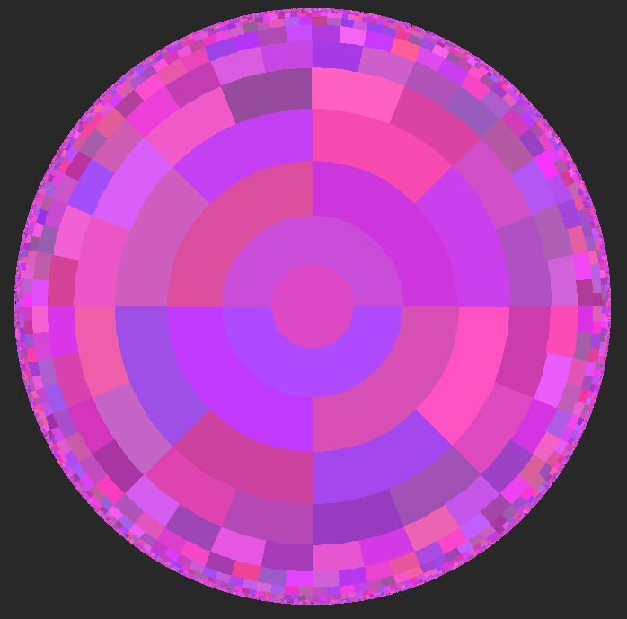 |

[`H2Lookup`](src/hypercrystal/misc/h2_lookup.py) is the library’s spatial hash. It partitions H² into adaptive angular/radial bins organized like a binary tree: each step outward doubles angular resolution, so bin keys resemble `(theta_bin, alpha_bin)` pairs. Declare `lookup: H2Lookup[BinType]`, then use `lookup[vector] = bin` (or `.get()`/`del`) to manage payloads by either `H2Vector` or hash code. Hash codes are of type `tuple[int, int]`.

The method `.around(key, distance=1)` returns the contents of neighboring bins after converting `key` to a hash. Underneath, `.around` relies on `hashes_around`, which walks the tree via `hash_plus/hash_minus`, `hash_above`, and `hashes_below`. Together they make broad-phase collision checks trivial: drop objects into the lookup, query `.around(point)` to pull only nearby bins, then run precise tests.

For visualization and debugging, `H2Lookup` can convert bins back into geometry. `hash_to_polygon(hash_code, detail, subdivide_lines)` produces an `H2Polygon` outlining one bin, while `get_polygons(detail, subdivide_lines)` yields every occupied bin at once—ideal for drawing the hash grid in your scene.

If you need more control, helpers like `vector_to_hash_code`, `hash_code_to_vector`, and the directional hash operators let you traverse or manipulate the tree manually.

## Directory Overview

- [src/hypercrystal/](src/hypercrystal)
  - [h2_math/](src/hypercrystal/h2_math): Hyperbolic vectors, transforms, rays, helper functions.
  - [misc/](src/hypercrystal/misc): Cameras, walkers, lookup utilities used by projections and demos.
  - [projections/](src/hypercrystal/projections): Models that map H² entities into drawable Euclidean scenes.
  - [shapes/](src/hypercrystal/shapes): Core geometry (lines, circles, polygons, horocycles, etc.).
  - [tessellations/](src/hypercrystal/tessellations): Tile generation and traversal helpers.
  - *[notation.py](src/hypercrystal/notation.py): Shared constants and naming helpers.
- [examples/](examples): Optional gallery of ready-made scenes (not shipped
  with the PyPI release).

## Contributing

1. Fork and clone the repo.
2. Install dev dependencies: Run `pip install -e .` to install the package in editable mode. This allows you to modify the code in `src/hypercrystal/` and see changes immediately without reinstalling. If you need additional development tools (e.g., testing frameworks, linters), install them separately.
3. Add your features in `src/hypercrystal/` (e.g., new shapes in `src/hypercrystal/shapes/`, new projections in `src/hypercrystal/projections/`, etc.).
4. Run or add scripts in `examples/` to exercise and test your new features.
5. Open a pull request with a short description and screenshots if relevant.
